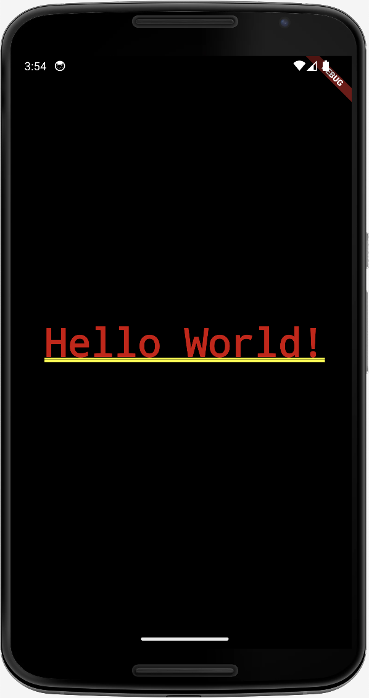

# i_am_rich

> First app to create in flutter.

Flutter apps is formed of widgets.
Each widget can be a container of other widgets.

To add text to the app, we use the widget Text.

```dart
Text('Hello World!)
```

Text widgets are placed in the top left corner of its parent widget.
In order to center the text, we use the widget Center.

> To have a well formated code in dart, we use dartfmt.
> you have to help it by adding a comma after each widget. 
> as shown in the example below.

```dart
Center(
  child: Text('Hello World!'),
)
```

The main function is the entry point of our application.

```dart
void main() {
  runApp(
    MaterialApp(
      home: Center(
        child: Text("Hello World!"),
      ),
    ),
  );
}
```

| iOS | Android |
|--|--|
|||
