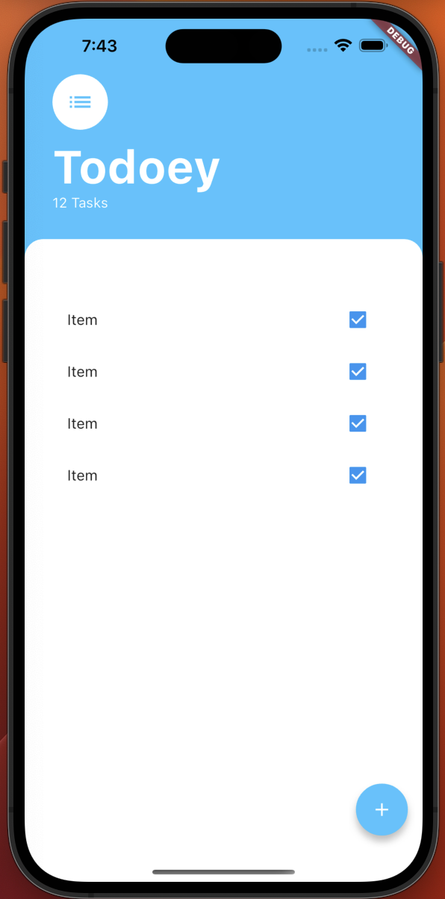
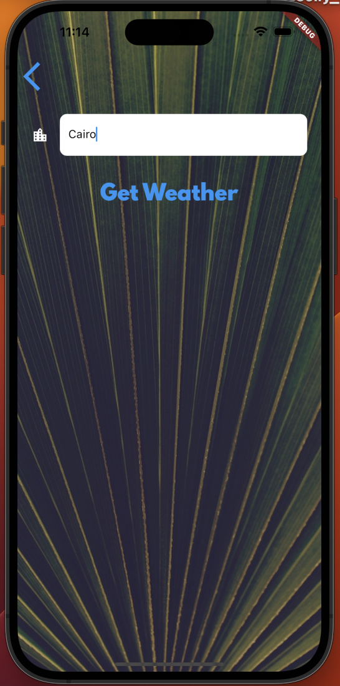
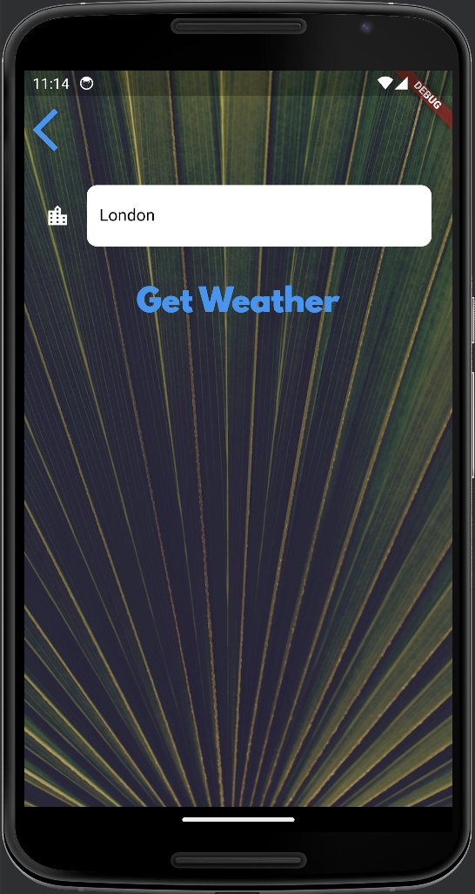

# i_am_rich

> First app to create using flutter.

Flutter apps is formed of widgets.
Each widget can be a container of other widgets.

To add text to the app, we use the widget Text.

```dart
Text('Hello World!')
```

Text widgets are placed in the top left corner of its parent widget.
In order to center the text, we use the widget Center.

> To have a well formated code in dart, we use **dartfmt**.
> you have to help it by adding a comma after each widget. 
> as shown in the example below.

```dart
Center(
  child: Text('Hello World!'),
)
```

The main function is the entry point of our application.
> ***Material app*** is the basis for all the other widgets.

```dart
void main() {
  runApp(
    MaterialApp(
      home: Center(
        child: Text('Hello World!'),
      ),
    ),
  );
}
```

| iOS | Android |
|--|--|
|||

**Scaffold** allows us to have a basic structure for our app. It is a widget that contains a lot of other widgets such as:

- AppBar
- FloatingActionButton
- BottomNavigationBar
- Drawer
- ...

```dart
MaterialApp(
    home: Scaffold(
        body: Center(
          child: Text('Hello World!'),
        ),
    ),
)
```

**App Bar** is a widget provided by the scaffold widget that allows us to have a bar at the top of the screen.
> **backgroundColor** is a property that allows us to change the background color of a widget.
```dart
MaterialApp(
    home: Scaffold(
        appBar: AppBar(
          title: Text('I Am Rich'),
          backgroundColor: Colors.blueGrey[900],
        ),
    ),
),
```

| iOS | Android |
|--|--|
|||

**body** is the primary content of the scaffold widget. It is a widget that contains other widgets.

```dart
MaterialApp(
    home: Scaffold(
        appBar: AppBar(
          title: Text('I Am Rich'),
          backgroundColor: Colors.blueGrey[900],
        ),
        body: Center(
          child: Text('Hello World!'),
        ),
        backgroundColor: Colors.blueGrey,
    ),
),
```

**Image** is a widget that allows us to display an image, and it provide us with multiple ways to access images from different sources such as:

- Network
- Asset
- File
- Memory

we use the property **image** to specify the image we want to display.

```dart
MaterialApp(
    home: Scaffold(
        appBar: AppBar(
          title: Text('I Am Rich'),
          backgroundColor: Colors.blueGrey[900],
        ),
        body: Image(
          image: NetworkImage(
              'https://www.seiu1000.org/sites/main/files/main-images/camera_lense_0.jpeg'),
        ),
        backgroundColor: Colors.blueGrey,
    ),
),
```

| iOS | Android |
|--|--|
|||