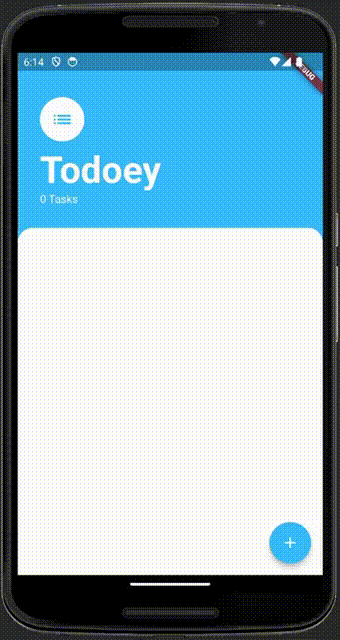
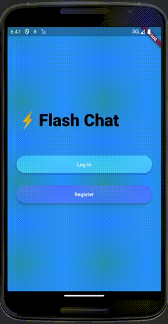
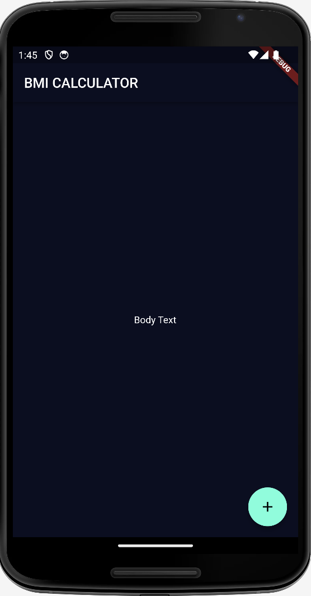
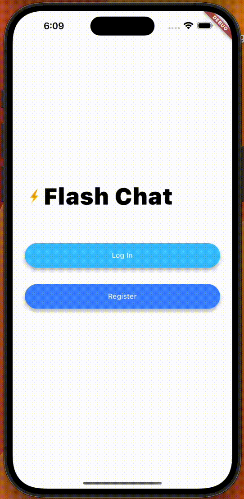
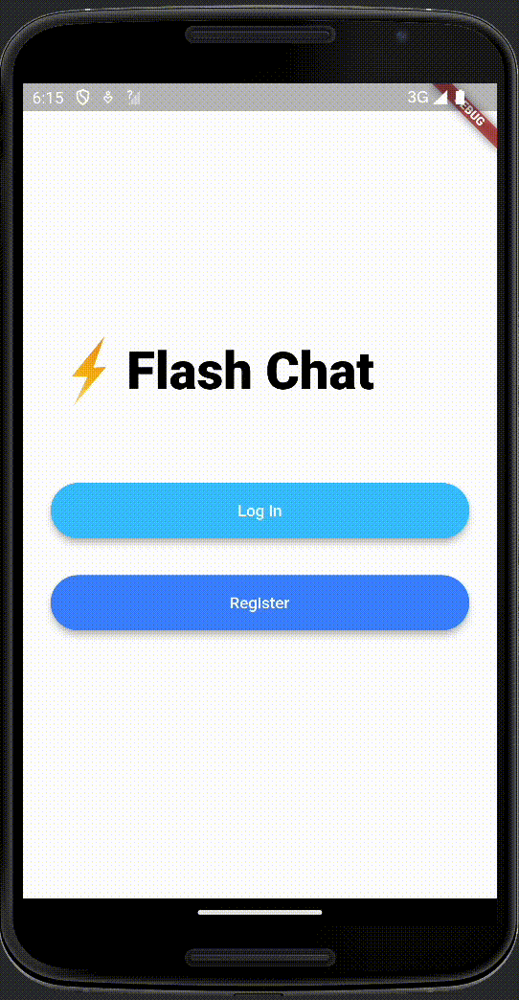

# dicee

This is a simple dice app that generates a random number between 1 and 6 when the user presses the dice to roll it.

it teaches us about:

- **OverFlow** & **Expanded**
- **flex** property
- **Text Button**
- **Stateless** & **Stateful**
- **setState()**

|iOS|Android|
|---|---|
|||

## magic_8_ball

This is a simple magic 8 ball app that generates a random answer when the user presses the ball, added as a challenge to ensure that we understood the concepts.

|iOS|Android|
|---|---|
|||

## Tutorial

Adding images in the app is very easy, But we need to manage the size of the images in the app. so it can be displayed properly in all devices as in the example below.

Instead of using the `Image` widget, we can use the `Image.asset` widget to display the images in the app for better code readability.

```dart
Image.asset('images/dice1.png')
```

|iOS|Android|
|---|---|
|||

What happened here is called **Overflow**. The image is too big to fit in the screen. So it is overflowing. We can fix this by using the `Expanded` widget.

**Expanded** widget is used to make the child widget take up the available space in the row or column, without specifying the width or height, and prevent overflow.

```dart
Expanded(
  child: Image.asset('images/dice1.png'),
),
```

|iOS|Android|
|---|---|
|||

**flex** property in the `Expanded` widget is used to specify the ratio of the space that the child widget should take up compared to its siblings in a row or column, the default value is ***1***.

```dart
Row(
  children: [
    Expanded(
      flex: 5,
      child: Image.asset('images/dice1.png'),
    ),
    Expanded(
      flex: 12,
      child: Image.asset('images/dice1.png'),
    ),
  ],
);
```

|iOS|Android|
|---|---|
|||

**Text Button** widget is used to create a simple button without any background color, elevation or shadows, Buttons are used to trigger an action, like navigating to a new screen, or submitting a form.

**onPressed** property in the `TextButton` widget is used to specify the action that should be triggered when the button is pressed.

```dart
TextButton(
  onPressed: () {
    print('Left button pressed');
  },
  child: Image.asset('images/dice1.png'),
),
```

When the left dice (**Text Button**) is pressed, the console will print:
`Flutter: Left button pressed`

Before we start changing the dice images when the button is pressed, we need to learn about the differences between **Stateless** and **Stateful** widgets.

|Stateless|Stateful|
|---|---|
| Fields should be immutable (Do not change over time) | Fields can be mutable (Change over time) |
| Static widgets | Dynamic widgets |
| **Ex:** Text, Icon, Image, Container | **Ex:** Checkbox, Radio, Slider, Form |  

So we need to use our buttons widget inside a **Stateful** widget to change the dice images when the button is pressed. To inform a Flutter app that the state of the widget has changed, we need to use the `setState()` method as shown below.

```dart
class DicePage extends StatefulWidget {
  const DicePage({super.key});

  @override
  State<DicePage> createState() => _DicePageState();
}

class _DicePageState extends State<DicePage> {
  int leftDiceNumber = 1;
  @override
  Widget build(BuildContext context) {
    return Center(
      child: Row(
        children: [
          Expanded(
            child: TextButton(
              onPressed: () {
                setState(() {
                  leftDiceNumber = 4;
                });
              },
              child: Image.asset('images/dice$leftDiceNumber.png'),
            ),
          ),
          Expanded(
            child: TextButton(
              onPressed: () {
                print('Right button pressed');
              },
              child: Image.asset('images/dice1.png'),
            ),
          ),
        ],
      ),
    );
  }
}
```

Once the left button is pressed, `setState()` method will be called to inform that the state of the widget has changed, and the `build()` method will be called again to rebuild the widget with the new state causing the **dice1** image to be replaced with **dice4** image.

|iOS|Android|
|---|---|
|||
